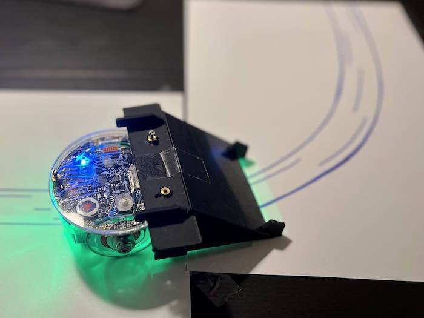

# ZIKBOT: robot lecteur de partition
Mini-projet de robotique (BA6 - EPFL) sur e-puck par: Julie Böhning et Timothée Bader. 

### L'objectif
Le but de ce robot et de suivre une partition qui prend la forme de chemin et de jouer les notes lues au fil de son parcours. Les partitions peuvent comportée des virages et être dessinées à la main. Les notes pouvant être jouées sont celles de la gamme. 

### Hardware
Fonctionne avec un miroir à 45° pour que la caméra qui pointe horizontalement vers l'avant puisse voir le sol. Au niveau des capteurs, la caméra, le capteur de proximité infrarouge et en actuateur les roues. Le speaker est évidement aussi utilisé pour la partie son. 

### Resultat (video sans son)

